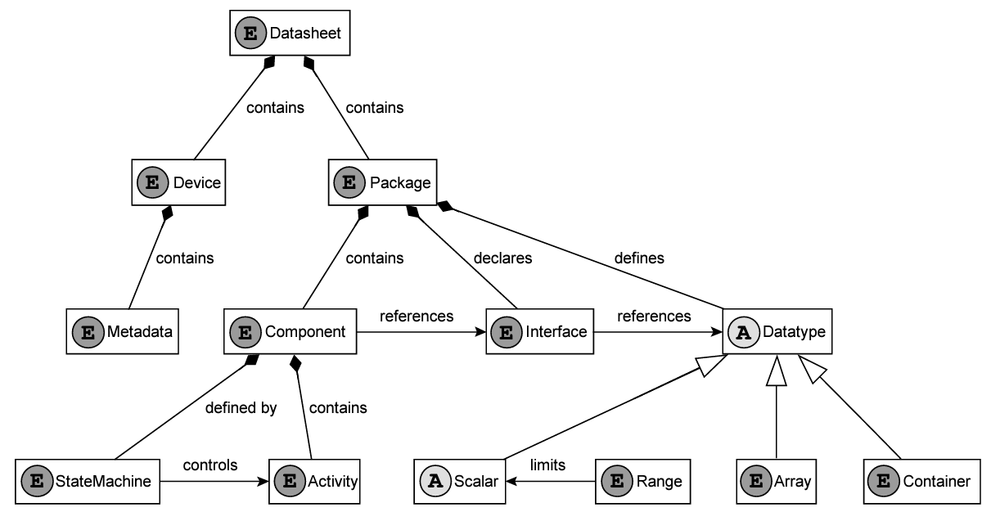
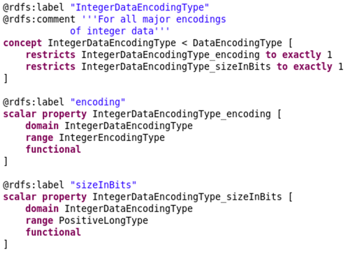
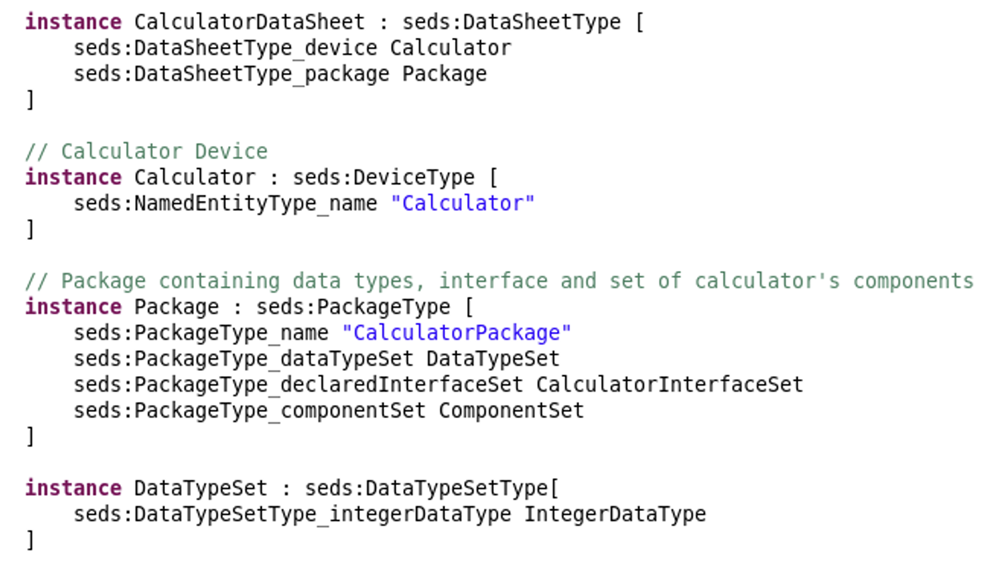

# OML Meta-model of Electronic Data Sheet

## Authors
Bc. [Michael Kozel](https://www.linkedin.com/in/michael-kozel/)\
Bc. [Patrik Mokriš](https://www.linkedin.com/in/patrik-mokri%C5%A1/)

Software Engineering students from Czech Technical University in Prague

## Introduction
This project was done as team assignment for course LOG8505E at Polytechnique Montréal 2023.
The focus of the course was to introduce students to Model Driven Software Engineering and 
let them practice and test obtained knowledge about DSMLs (Domain Specific Modeling Language)
on real-world project. The selected domain of the project were Electronic Data Sheets (EDS) in the space industry.
Throughout this course we had an opportunity to cooperate and get feedback from OpenCaesar and NASA
engineers. This post is the final output from our assignment. For all output of our work check [Github](https://github.com/mokripat/LOG8505E_Deliverable)
repository of this project.

## Problem description

## Methodology

The methodology included comprehensive examination and study of the SEDS domain. For creating of the meta-model itself,
the main source was a XSD specification, obtained from https://sanaregistry.org/r/sois/. With PDF description of SEDS,
it served as our source of truth. To create the meta-model, our approach was to utilize a series of transformations facilitated 
by various tools. Initially, we employed the tool available [here](https://www.davidpace.de/generating-emf-models-from-xml-schema-definitions-xsds/) 
for the first transformation, converting the XSD specification into an Ecore model. 
Subsequently, the Ecore model underwent a second transformation utilizing the tool 
available at OpenCaesar [Github](https://github.com/opencaesar/ecore-adapter), transitioning it into an OML vocabulary. 
This was one of the recommended methodologies. Afterward, from the abstract OML vocabulary we instantiated a 
concrete OML description. Having the description, it is possible to create a SPARQL queries to data-mine information
from the model.

## Progress background

During the course of our project involving Ecore to the OML Adapter, we encountered a bug that led
to a _NullPointerException_ within the Adapter. We tried to fix this issue independently, we undertook 
debugging efforts which resulted in commenting out a line of code responsible for triggering this failure. 
This resulted in obtaining an output from the adapter which we considered as a base of our OML dictionary. We referred to
it as a "proto" meta-model. However, as we discovered throughout time, it was far from a complete and usable meta-model. To put it simply, it generated
all elements from the specification but not their relationships or generalization.

<figure>
    
    <figcaption>Proto meta-model visualization</figcaption>
</figure>

Over a span of four weeks, our team diligently worked on tuning the meta-model manually. By analysing the XSD specification
we created few python scripts that would parse the relationships, generalization and documentation from it to
enhance the proto meta-model. Despite our efforts, the complexity of SEDS domain was too high to spot and finishing
all constraints, restrictions and details of the specification. Instantiating the meta-model was impossible. At least,
it helped us greatly in understanding the domain.

<figure>
    
    <figcaption>Proto meta-model improvement, the complexity does not allow view of the whole meta-model even on the smallest zoom ration (5%)</figcaption>
</figure>

After second round of feedback, we reported the exact bug to Elaasar Maged, which by cooperation was fixed and we obtained
the correct and fully-detailed OML vocabulary. However, we had only a week left to complete our assignment.

## Metamodel (Vocabulary)

In this section, we would like to present and explain the final OML vocabulary. As could be seen in previous
section, the meta-model is quite complex. With documenting comments, it has 3658 lines.

Firstly, the list of used OML keywords to define elements of the meta-model is as follows:
- Aspect - used for abstract types
- Concept - used for defining specific types (classes)
- Relation - used for modeling relation between classes
- Scalar - used to define sets of values that can be assigned
- Scalar property - used to specify types properties (class variables)

Secondly, the list of used OML keywords to define constraints of the meta-model is as follows:
- functional - can have a maximum one value per instance (constraint for relations)
- domain - constraint for type that scalar property belongs to
- range - constraint for range of values that scalar property can have
- restricts (to exactly, to min) - constraint how many instances of scalar property can type have

In the following image, the high-level schema of the metamodel corresponding to official specification.
It describes all main components of the EDS. Root component Datasheet consists of two parts: 
- Device - wraps information and meta-data of the concrete device
- Package - wraps three major parts defining the funcionality, interface and used data types of the device

<figure>
    
    <figcaption>High-level schema of the metamodel</figcaption>
</figure>

### Vocabulary examples

In this section, it is shown how different OML keywords in the vocabulary were used. Selected
examples showcase abstract syntax which will be used in the example in the next section.

#### Example 1
<figure>
    
    <figcaption>Example #1 - IntegerDataEncodingType</figcaption>
</figure>

_IntegerDataEncodingType_ uses **concept** keyword to define encoding type for integers which derives from NumericDataType.
It contains two class variables _encoding_ and _sizeInBits_. These class variables are defined using **scalar property**.
With usage of **restricts** we specify that every instance of this element must have values of these variables
assigned and exactly one time.

Both class variables have specified:
- **domain** to express being assigned to _IntegerDataEncodingType_
- **range** to express allowed values (list of values or range)
- **functional** trait expressing that instance of the class variable can belong only to one instance of the _IntegerDataEncodingType_

#### Example 2

<figure>
    
    <figcaption>Example #2 - DataEncodingType and ByteOrderType</figcaption>
</figure>

## Instance Model - Calculator

## Reflection

## Conclusion