# OML Meta-model of Electronic Data Sheet

## Authors
Bc. [Michael Kozel](https://www.linkedin.com/in/michael-kozel/)\
Bc. [Patrik Mokriš](https://www.linkedin.com/in/patrik-mokri%C5%A1/)

Software Engineering students from Czech Technical University in Prague

## Introduction
This project was done as team assignment for course LOG8505E at Polytechnique Montréal 2023.
The focus of the course was to introduce students to Model Driven Software Engineering and 
let them practice and test obtained knowledge about DSMLs (Domain Specific Modeling Language)
on real-world project. The selected domain of the project were Electronic Data Sheets (EDS) in the space industry.
Throughout this course we had an opportunity to cooperate and get feedback from OpenCaesar and NASA
engineers. This post is the final output from our assignment. For all output of our work check [Github](https://github.com/mokripat/LOG8505EDeliverable)
repository of this project.

## Problem description

Electronic Data Sheets (EDS) are comprehensive documents that contain detailed information about various 
electronic components used in space missions, satellites, spacecraft, and other aerospace applications. These sheets
serve as a standardized reference for engineers, designers, and technicians involved in the development, maintenance,
and repair of electronic systems used in space exploration. These sheets play a vital role in the design, testing, and operation of electronic systems critical for space exploration endeavors.

The high-level objective of this project was to explore, analyse and data-mine this standardized domain. By creating the OML model
we would face Model-Driven Engineering challenges, dive into complexity and standardization of EDS and come up
with feedback or potentially improvements of the EDS regarding data interoperability in Space Industry.

We were given task to create a meta-model of EDS using OML. It had four stages OML vocabulary, OML description, 
writing SPARQL queries and some form of transformation. Those four stages corresponds to traditional steps of MDD
using DSML. 

Our team main goal was to create an OML meta-model based on already existing XSD specification and data-mine information
from it using SPARQL. With this approach we could test and verify this specification opposed to the official documentation
of EDS. Throughout this process we would collect knowledge and feedback to provide.

## Methodology

The methodology included comprehensive examination and study of the SEDS domain. For creating of the meta-model itself,
the main source was a XSD specification, obtained from https://sanaregistry.org/r/sois/. With PDF description of SEDS,
it served as our source of truth. To create the meta-model, our approach was to utilize a series of transformations facilitated 
by various tools. Initially, we employed the tool available [here](https://www.davidpace.de/generating-emf-models-from-xml-schema-definitions-xsds/) 
for the first transformation, converting the XSD specification into an Ecore model. 
Subsequently, the Ecore model underwent a second transformation utilizing the tool 
available at OpenCaesar [Github](https://github.com/opencaesar/ecore-adapter), transitioning it into an OML vocabulary.
This was one of the recommended methodologies. For working with the OML, we were advised to use a tool called [Rosetta](https://github.com/opencaesar/oml-rosetta)
which is built on Eclipse IDE. Afterward, from the abstract OML vocabulary we instantiated a 
concrete OML description. Having the description, it is possible to create a SPARQL queries to data-mine information
from the model.

## Progress background

During the course of our project involving Ecore to the OML Adapter, we encountered a bug that led
to a NullPointerException within the Adapter. We tried to fix this issue independently, we undertook 
debugging efforts which resulted in commenting out a line of code responsible for triggering this failure. 
This resulted in obtaining an output from the adapter which we considered as a base of our OML dictionary. We referred to
it as a "proto" meta-model. However, as we discovered throughout time, it was far from a complete and usable meta-model. To put it simply, it generated
all elements from the specification but not their relationships or generalization.

<figure>
    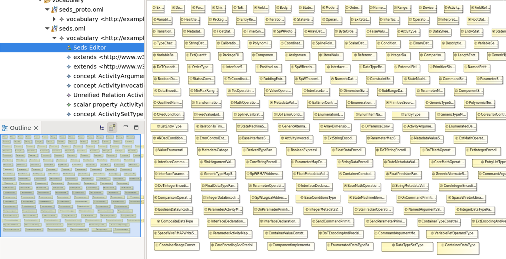
    <figcaption>Proto meta-model visualization</figcaption>
</figure>

Over a span of four weeks, our team diligently worked on tuning the meta-model manually. By analysing the XSD specification
we created few python scripts that would parse the relationships, generalization and documentation from it to
enhance the proto meta-model. Despite our efforts, the complexity of SEDS domain was too high to spot and finishing
all constraints, restrictions and details of the specification. Instantiating the meta-model was impossible. At least,
it helped us greatly in understanding the domain.

<figure>
    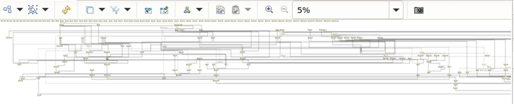
    <figcaption>Proto meta-model improvement, the complexity does not allow view of the whole meta-model even on the smallest zoom ration (5%)</figcaption>
</figure>

After second round of feedback, we reported the exact bug to Elaasar Maged, which by cooperation was fixed and we obtained
the correct and fully-detailed OML vocabulary. However, we had only a week left to complete our assignment.

## Metamodel (Vocabulary)

In this section, we would like to present and explain the final OML vocabulary. As could be seen in previous
section, the meta-model is quite complex. With documenting comments, it has 3658 lines.

Firstly, the list of used OML keywords to define elements of the meta-model is as follows:
- Aspect - used for abstract types
- Concept - used for defining specific types (classes)
- Relation - used for modeling relation between classes
- Scalar - used to define sets of values that can be assigned
- Scalar property - used to specify types properties (class variables)

Secondly, the list of used OML keywords to define constraints of the meta-model is as follows:
- functional - can have a maximum one value per instance (constraint for relations)
- domain - constraint for type that scalar property belongs to
- range - constraint for range of values that scalar property can have
- restricts (to exactly, to min) - constraint how many instances of scalar property can type have

In the following image, the high-level schema of the metamodel corresponding to official specification.
It describes all main components of the EDS. Root component Datasheet consists of two parts: 
- Device - wraps information and meta-data of the concrete device
- Package - wraps three major parts defining the funcionality, interface and used data types of the device

<figure>
    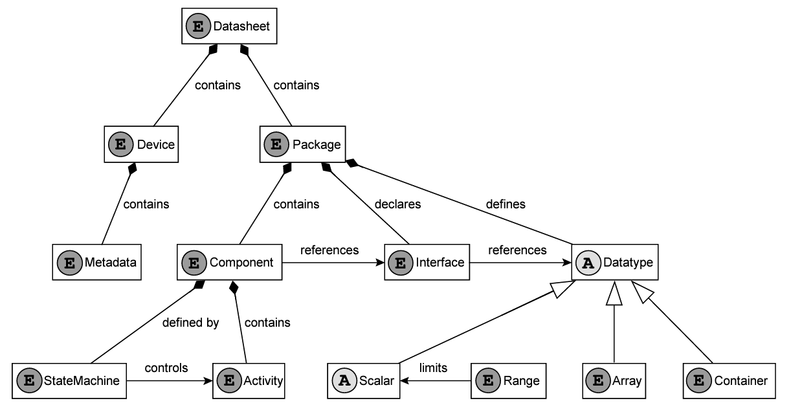
    <figcaption>High-level schema of the metamodel</figcaption>
</figure>

### Vocabulary examples

In this section, it is shown how different OML keywords in the vocabulary were used. Selected
examples showcase abstract syntax which will be used in the example in the next section.

#### Example 1

<figure>
    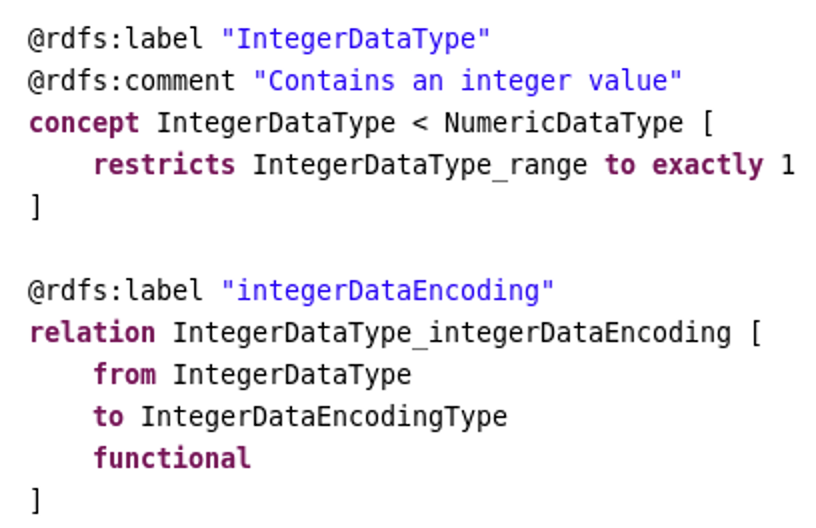
    <figcaption>Example #1 - IntegerDataType</figcaption>
</figure>

To define integers, IntegerDataType was defined using **concept** keyword. It is a specialization of the NumericDataType.

It possesses a single class variable named integerDataEncoding, defined as a **relation**. This means that it expects
an instance as a value and creates a connection between two instances when assigned. 
The integerDataEncoding relation is guarded by the following constraints:

- **from** - specifies that this relation originates from instances of IntegerDataType.
- **to** - indicates that the relation points to instances of IntegerDataEncodingType.
- **functional** - implies that each instance of IntegerDataType can be associated with at most one instance of IntegerDataEncodingType through this relation.

The IntegerDataType concept is further restricted by specifying exactly one value for the IntegerDataType_range.

#### Example 2

<figure>
    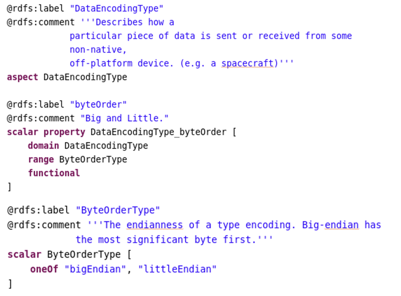
    <figcaption>Example #2 - DataEncodingType and ByteOrderType</figcaption>
</figure>

To define abstract type DataEncodingType, **aspect** keyword was used. It contains a single class variable named byteOrder,
established using the **scalar property** construct. The byteOrder class variable is defined with the following constraints:

- **domain** - specifies that this property is applicable to instances of the DataEncodingType.
- **range** - indicates the possible values which are enumerated under the ByteOrderType.
- **functional** - implies that each instance of DataEncodingType can possess only one value for byteOrder.

ByteOrderType is a **scalar** type that defines enumeration of two specific values - "bigEndian" and "littleEndian" - representing the two possible endianness formats.

#### Example 3

<figure>
    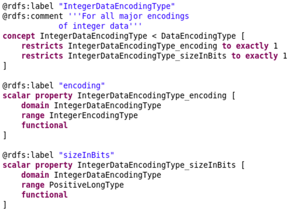
    <figcaption>Example #3 - IntegerDataEncodingType</figcaption>
</figure>

IntegerDataEncodingType uses **concept** keyword to define encoding type for integers which derives from DataEncodingType.
It contains two class variables encoding and sizeInBits. These class variables are defined using **scalar property**.
With usage of **restricts** we specify that every instance of this element must have values of these variables
assigned and exactly one time.

Both class variables have specified:
- **domain** to express being assigned to IntegerDataEncodingType
- **range** to express allowed values (list of values or range)
- **functional** trait expressing that instance of the class variable can belong only to one instance of the IntegerDataEncodingType

## Instance Model - Calculator

To show concrete syntax we chose to instantiate DataSheet specification for Calculator from one of the given Space Creator examples
The instance is a simple calculator with the ability to sum two integers from range <-1000000,1000000>

It contains:
- StateMachine with 2 states - Init and Idle
- 2 commands: Init and Add
- 1 activity - AddAndNotifyActivity
- 5 variables for calculation purposes
- 2 operations with two arguments - Add and Swap

### Description syntax example
In following images we will describe the description of the calculator

<figure>
    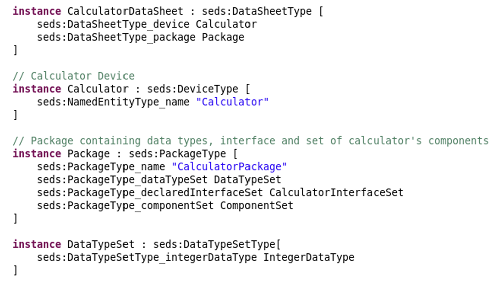
    <figcaption>Example #4 - CalculatorDataSheet</figcaption>
</figure>

To define calculator, we started to create instances of all elements in the DataSheet metamodel
First we created the instance of the DataSheet with name CalculatorDataSheet and instance of related elements: Package, DeviceType and DataTypeSetType.
Then it was able to tie those elements with relations.

<figure>
    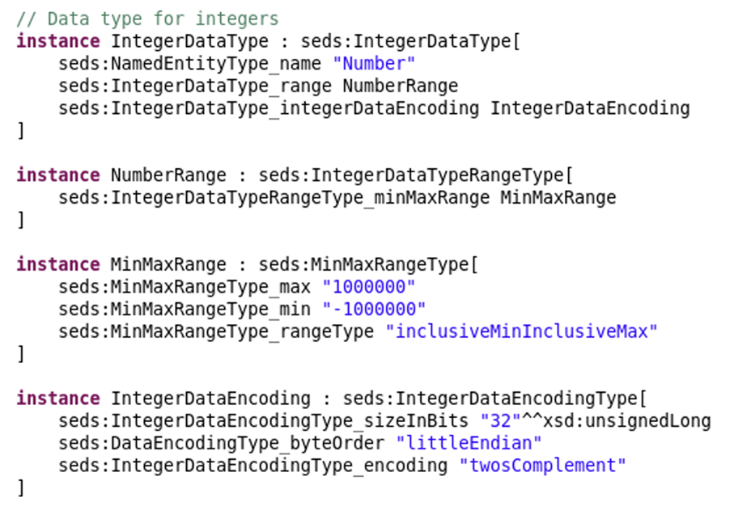
    <figcaption>Example #5 - Number</figcaption>
</figure>

As the calculator need to deal with numbers it was needed to create its instance and set
its range and encoding.

<figure>
    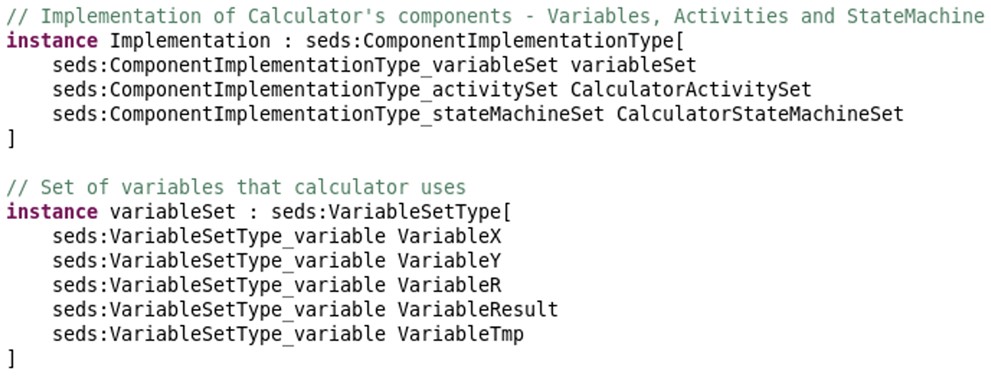
    <figcaption>Example #6 - Implementation</figcaption>
</figure>

In the example #5 is created instance of ComponentImplementationType and a VariableSetType where are definitions
of the 5 variables that the calculator needs to work with.

<figure>
    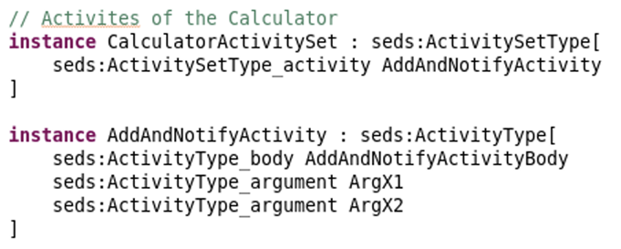
    <figcaption>Example #7 - Activity</figcaption>
</figure>

To create an activity, we instantiated the ActivityType to the AddAndNotifyActivity, also this activity
has two arguments, that are two numbers that will be added.

<figure>
    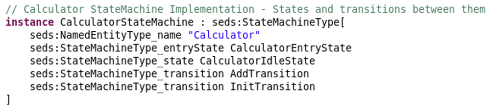
    <figcaption>Example #8 - StateMachine</figcaption>
</figure>

Then we also created a state machine that had two states which has been also instantiated
and then associated with this CalculatorStateMachine.

<figure>
    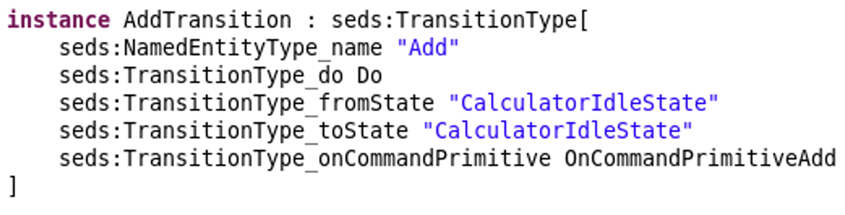
    <figcaption>Example #9 - Transition</figcaption>
</figure>

In the Example #9 is the instance of one transition. This transition changes state from the CalculatorIdleState to the CalculatorIdleState.
<figure>
    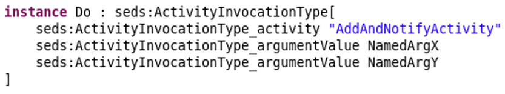
    <figcaption>Example #10 - Activity instance</figcaption>
</figure>

## Instance model
On these images we can see how the vocabulary corresponds to the metamodel.
It is hard to display the whole model, so for the better understandability we provide
a simplified model which contains all important parts.

In the Example #11 and Example #12 we can see a higher level view with the system as a whole and 
the relations between all elements of the description of the electronic datasheet.

<figure>
    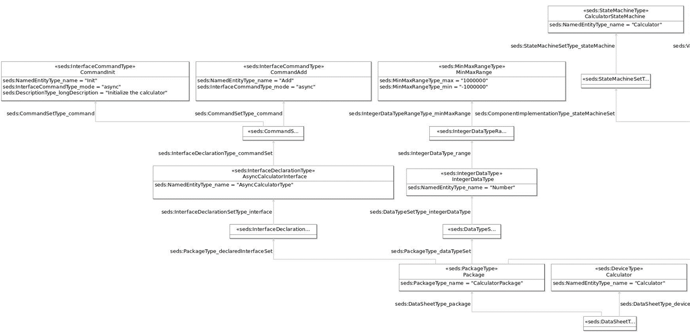
    <figcaption>Example #11 - Instance model - first part</figcaption>
</figure>

<figure>
    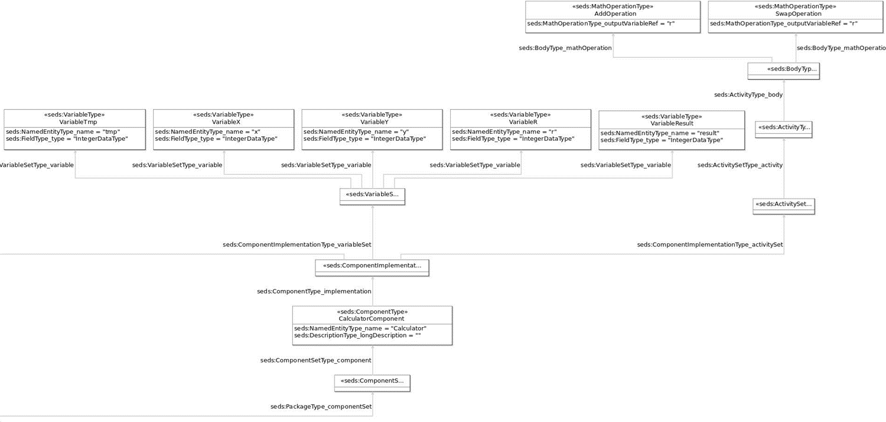
    <figcaption>Example #12 - Instance model - second part</figcaption>
</figure>

## Reflection

Reflecting on our project journey, it's evident that we struggled with the proto meta-model that hindered our progress significantly. 
The time invested in completing the prototype output through the adapter ended up being a loss, costing us not finishing on time.
We realized, later than anticipated, that Maged could have helped us much earlier, highlighting a need 
for more proactive communication and inquiry. Our oversight resulted in missed opportunities to delve deeper
into transformation processes and accomplish our goal. 

However, despite the challenges, 
this experience was not without earning valuable knowledge and contributions. 
We sharpen our proficiency in Python, deeply learned about SEDS concepts, and delved into the fundamentals of the OML
language within the Eclipse environment. Constructing abstract syntax and integrating it with concrete syntax
in a complex domain taught us perseverance in the face of complexity. Lastly, the discovery and fix of the Ecore
to OML adapter bug helped the tool to be more robust for future uses.

Undoubtedly, this journey underscored the inherent difficulties, reminding us 
of the resilience needed when navigating complicated tasks. Looking ahead, these insights will profoundly influence
our future approaches, underscoring the significance of proactive collaboration and comprehensive exploration
to streamline our path forward.

## Conclusion
In this project we created a complete and precise meta model of Spacecraft onboard interface services
electronic data sheets.
We analysed the domain of the Electronic Data Sheets and created an OML meta model using the provided tools, namely
- Eclipse for converting a XSD model to the Ecore model
- Ecore to OML adapter for creating OML meta model from Ecore meta model.

During the transformations of the metamodel we ran into several problems with the provided ECORE to OML, which we firstly were trying to repair ourselves 
but without success. Then after contacting Maged Elaasar - the author of the Ecore to OML adapter, it was able to create the metamodel in OML.
However due to these problems after the repairing of the tool we had about two days to create some reasonable output. 
We ended up creating a description of the calculator instance, but due to a Gradle :owlReason task errors we hadn't been able to
create SPARQL queries.
Our output can be seen in a [github repository](https://github.com/mokripat/LOG8505E_Deliverable).
